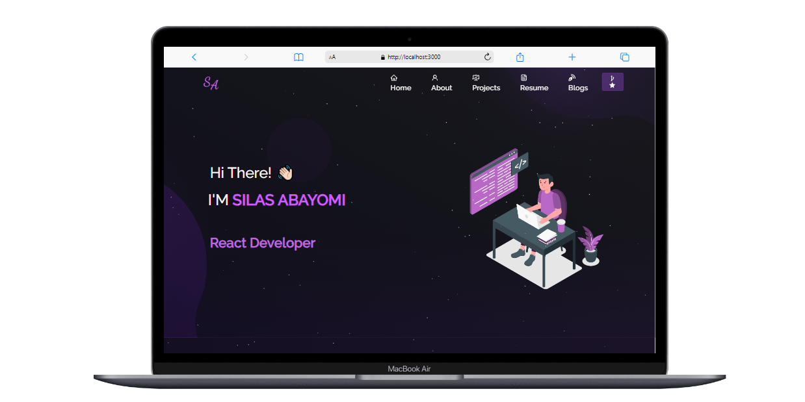

<h2 align="center">
  Portfolio Website 
  <a href="https://my-portfolio-phi-wine-48.vercel.app/" target="_blank">silasabayomi</a>
</h2>

  

 

<h3 align="center">
    🔹
    <a href="https://github.com/Haybesil/MyPortfolio/">Report Bug</a> &nbsp; &nbsp;
    🔹
    <a href="https://github.com/Haybesil/MyPortfolio/">Request Feature</a>
</h3>

## TL;DR

You can fork this repo to modify and make changes of your own. Please give me proper credit by linking back to [HaybeSil](https://github.com/Haybesil/MyPortfolio/). Thanks!

## Built With

My personal portfolio <a href="https://my-portfolio-phi-wine-48.vercel.app/" target="_blank">silas abayomi</a> which features some of my github projects as well as my resume and technical skills. 

This project was built using these technologies.

- React.js
- Node.js
- CSS3
- VsCode
- Vercel

## Features

**📖 Multi-Page Layout**

**🎨 Styled with React-Bootstrap and Css with easy to customize colors**

**📱 Fully Responsive**

## Getting Started

## 🛠 Installation and Setup Instructions

1. Installation: `npm install`

2. In the project directory, you can run: `npm start`

Runs the app in the development mode.\
Open [http://localhost:3000](http://localhost:3000) to view it in the browser.
The page will reload if you make edits.

## Usage Instructions

Open the project folder and Navigate to `/src/components/`.  
You will find all the components used and you can edit your information accordingly.

### Show your support

Give a ⭐ if you like this website!

